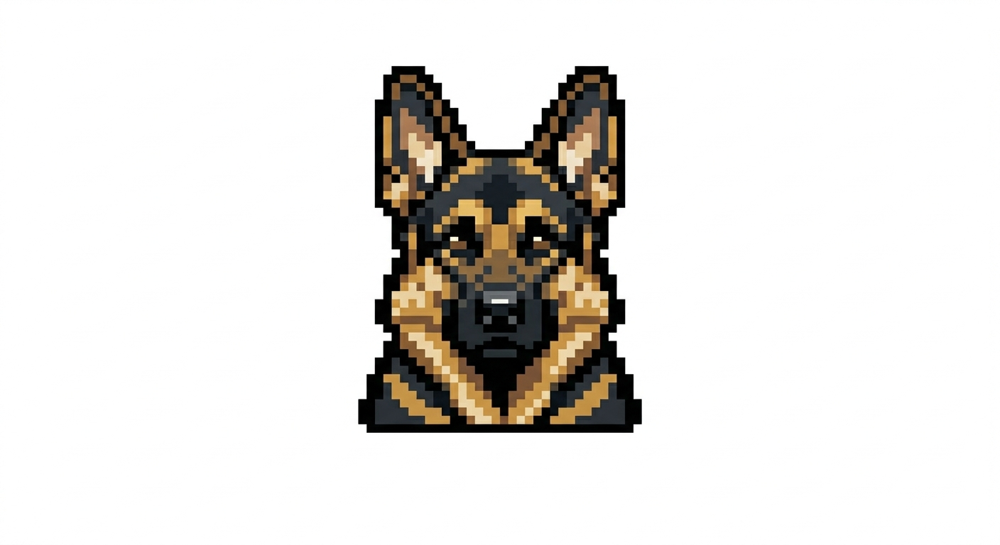

  <!-- Logo -->
  

  <!-- Main Titles -->
  <h1>DogmaLab</h1>
  

    <strong>A platform of harnesses that takes transformer LLMs beyond the frontier, 
    with a cost that is affordable and calculable.</strong>
  

  <!-- Tech Stack Badges -->
  

    
    
    
    
    
    
  

  

    <a href="https://github.com/dogmalab/.github/blob/main/MANIFESTO.md">Manifesto</a> •
    <a href="https://github.com/dogmalab/.github/blob/main/STRATEGY.md">Strategy</a> •
    <a href="https://github.com/dogmalab/.github/blob/main/FAQ.md">FAQ</a> •
    <a href="https://github.com/dogmalab/.github/blob/main/ROADMAP.md">Roadmap</a>
  

---

## The three harnesses

Dogma is a platform of three harnesses. Each is a self-contained
Rust project. The state harness and the agent harness have **zero
network code**. The network harness is the only listener.

<table style="border: none; width: 100%;">
  <tr>
    <td width="33%" valign="top" style="border: 1px solid #e1e4e8; border-radius: 6px; padding: 16px;">
      <h3>🗄️ dogma-vdb</h3>
      
<strong>The state harness.</strong> A vector database in one file. JSONL plus a binary v2 mmap. <code>cat</code> it, <code>grep</code> it, commit it. No server. No daemon. No connection string.

       
      <a href="https://github.com/dogmalab/dogma-vdb"><strong>Explore Repository →</strong></a>
    </td>
    <td width="33%" valign="top" style="border: 1px solid #e1e4e8; border-radius: 6px; padding: 16px;">
      <h3>🤖 dogma-agent</h3>
      
<strong>The agent harness.</strong> An AI runtime in one binary. Three tools, a loop, a state backend, and a Cost Gate that asks before it spends. Air-gapped by design.

       
      <a href="https://github.com/dogmalab/dogma-agent"><strong>Explore Repository →</strong></a>
    </td>
    <td width="33%" valign="top" style="border: 1px solid #e1e4e8; border-radius: 6px; padding: 16px;">
      <h3>🌐 dogma-gateway</h3>
      
<strong>The network harness.</strong> The only network listener. Bridges HTTP clients to the air-gapped core via IPC pipes and mmap. Stateless. Tiny binary.

       
      <a href="https://github.com/dogmalab/dogma-gateway"><strong>Explore Repository →</strong></a>
    </td>
  </tr>
</table>

---

## The flagship pattern: Enriched Inference

Inside the agent harness, the **Enriched Inference (IE)** pattern
runs N LLMs in parallel, synthesizes their responses with a
compiler model, iterates the synthesis, and produces a final
answer. The pattern is gated by a **Cost Gate** that estimates
the cost in USD, tokens, and wall-time before the run, and asks
the user to confirm.

The result: any combination of models — local, cloud, or mixed —
compounds into a quality that exceeds any single frontier model,
with a cost the user calculates and confirms before spending.

The claim is falsifiable. The open benchmark
([dogmalab/dogma-arena](https://github.com/dogmalab/dogma-arena))
is where it is tested.

---

## Why "platform of harnesses"?

A **framework** is something your code is hosted inside. A
**harness** is something you compose with. The difference matters:

- When you stop using a framework, you throw away the code.
- When you stop using a harness, the `.vdb` files you wrote
  still work in ten years.

We are not building the next LangChain. We are building the
harnesses that make models better than they thought they could
be. Read the [manifesto](https://github.com/dogmalab/.github/blob/main/MANIFESTO.md)
to understand why.

---

## The Four Questions

Before any new feature lands, it must answer **yes** to all four:

1. Would an indie AI builder ask for this in their first week?
2. Can we do this with the primitives we already have?
3. Does it break local-first, zero-config, or one-file state?
4. Does the harness have a Cost Gate?

If a feature fails one, we do not add it. If it fails two, we
reject it politely. The full rule is in
[CONTRIBUTING.md](https://github.com/dogmalab/.github/blob/main/CONTRIBUTING.md).

---

## Project status

We build in the open.

* 📈 **Roadmap:** See the
  [ROADMAP.md](https://github.com/dogmalab/.github/blob/main/ROADMAP.md)
  for the next 60-90 days.
* 🏟️ **Open benchmark:** [dogmalab/dogma-arena](https://github.com/dogmalab/dogma-arena)
  is where the "beyond the frontier" claim is tested.
* 🤖 **Reference agent:** [dogmalab/dogma-refagent](https://github.com/dogmalab/dogma-refagent)
  is the canonical example.
* 🤝 **Contribute:** Open an issue with the `[rfc]` tag in any
  repository. Read
  [CONTRIBUTING.md](https://github.com/dogmalab/.github/blob/main/CONTRIBUTING.md)
  first.

 

---

  Founded and led by <a href="https://github.com/arggil">@arggil</a>

